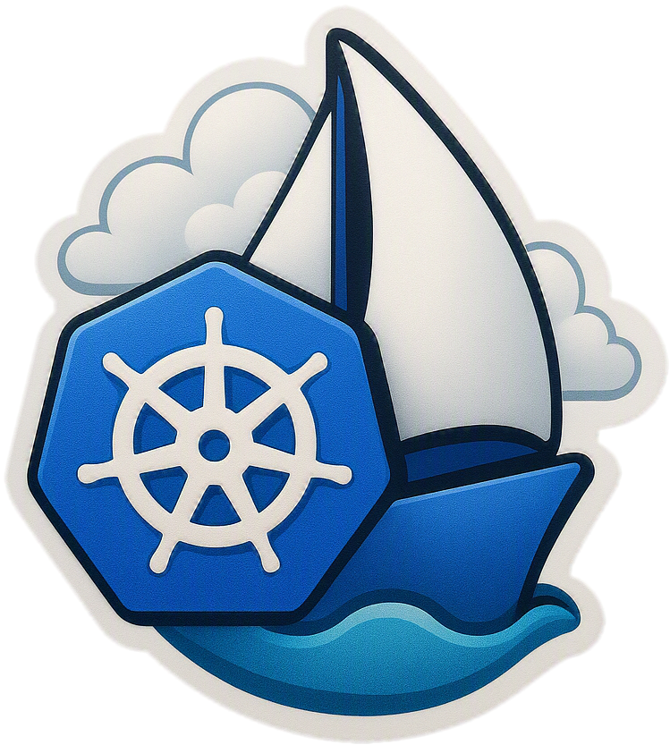

<h1 align="center">
  
   
  SAIL with Azure Red Hat OpenShift (ARO)
   
</h1>

## Objective

This Sovereign AI Landing Zone (SAIL) repository provides a secure foundation for
deploying the **Cohere North** agentic AI platform on **Azure Red Hat OpenShift
(ARO)** within Canada's borders, so organizations can build, scale, and innovate
while maintaining the highest standards of privacy and compliance. Sovereignty on
Azure is treated as satisfying two key requirements:

* Data **at rest** should be stored within Canadian Azure data centres
* Data **in-transit** should be processed within Canadian Azure data centres

Cohere North is a self-hosted, Kubernetes-native platform. On ARO it serves its
own generative, embedding, rerank, and vision-parser models on in-cluster GPU
nodes, and relies on a small set of external Azure managed services
(PostgreSQL, Redis) plus in-cluster OpenSearch. Because compute and data stay
within the customer's ARO cluster and Azure tenant in a Canadian region, this
pattern keeps both data at rest and data in-transit inside Canada.

> This repository was originally focused on deploying AI models via Azure PaaS
> (Azure Machine Learning, Microsoft Foundry, Azure Databricks). It has been
> refocused on hosting Cohere North on ARO; the Azure PaaS model-serving assets
> have been removed. For the Azure AI Landing Zone reference architecture, see
> [Azure AI Landing Zones](https://azure.github.io/AI-Landing-Zones/bicep/overview/).

## Architecture overview

The deployment is structured as an ARO landing zone hosting the North platform:

* **Private ARO cluster** (OpenShift 4.x, Kubernetes v1.30+) provisioned via IaC,
  with isolated node pools for control plane, infrastructure, standard workers,
  a dedicated OpenSearch pool, and a GPU pool for model serving.
* **Model serving** on in-cluster NVIDIA GPU nodes managed by the GPU Operator.
* **External managed dependencies**: Azure Database for PostgreSQL (Flexible
  Server) and Azure Cache for Redis, reached over private endpoints.
* **Platform services**: OpenShift GitOps (Argo CD), External Secrets Operator
  with Azure Key Vault, Entra ID authentication, and OpenShift Logging with
  forwarding to Azure Monitor.

## Infrastructure as code

The [`infra`](infra) folder contains the Azure Bicep foundation (virtual network,
private-endpoint subnet, and reusable Key Vault / container registry / Log
Analytics / storage modules) along with a PowerShell deployment script. See
[infra/README.md](infra/README.md) and [infra/DEPLOYMENT.md](infra/DEPLOYMENT.md).

## Documentation

* [`docs/`](docs) — Cohere North deployment reference material used to plan the
  ARO landing zone.

## Acknowledgements

Special thanks to the following individuals for their invaluable contributions to this repo:

- Shankar Ramachandran: https://github.com/shankar-r10n
- Amy Xin: https://github.com/amyxixin
- Sherif Messiha: https://github.com/shmessiha
- Theresa Palayoor

## Contributing

This project welcomes contributions and suggestions.  Most contributions require you to agree to a
Contributor License Agreement (CLA) declaring that you have the right to, and actually do, grant us
the rights to use your contribution. For details, visit [Contributor License Agreements](https://cla.opensource.microsoft.com).

When you submit a pull request, a CLA bot will automatically determine whether you need to provide
a CLA and decorate the PR appropriately (e.g., status check, comment). Simply follow the instructions
provided by the bot. You will only need to do this once across all repos using our CLA.

This project has adopted the [Microsoft Open Source Code of Conduct](https://opensource.microsoft.com/codeofconduct/).
For more information see the [Code of Conduct FAQ](https://opensource.microsoft.com/codeofconduct/faq/) or
contact [opencode@microsoft.com](mailto:opencode@microsoft.com) with any additional questions or comments.

## Trademarks

This project may contain trademarks or logos for projects, products, or services. Authorized use of Microsoft
trademarks or logos is subject to and must follow
[Microsoft's Trademark & Brand Guidelines](https://www.microsoft.com/legal/intellectualproperty/trademarks/usage/general).
Use of Microsoft trademarks or logos in modified versions of this project must not cause confusion or imply Microsoft sponsorship.
Any use of third-party trademarks or logos are subject to those third-party's policies.
